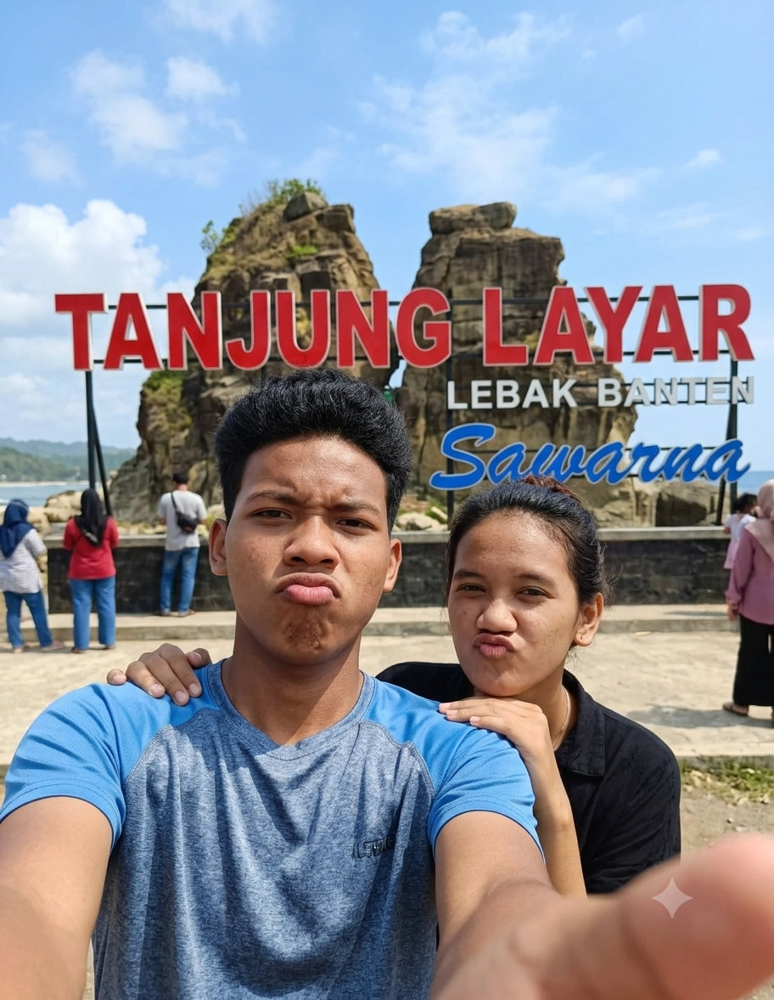

<!DOCTYPE html>
<html lang="id">
<head>
    <meta charset="UTF-8">
    <meta name="viewport" content="width=device-width, initial-scale=1.0">
    <title>Itinerary Liburan Sawarna (Slow Morning Fit)</title>
    
</head>
    
<body>

    <!-- Header Banner dengan Gambar Pilihan Sendiri -->
    <header>
        <h1>Itinerary Ke Sawarna</h1>
        
Tak peduli seberapa jauh jalannya, asal tujuannya bersamamu, aku pasti bahagia❤️

        
        <!-- Wadah Foto Profil -->
            
        

    </header>
